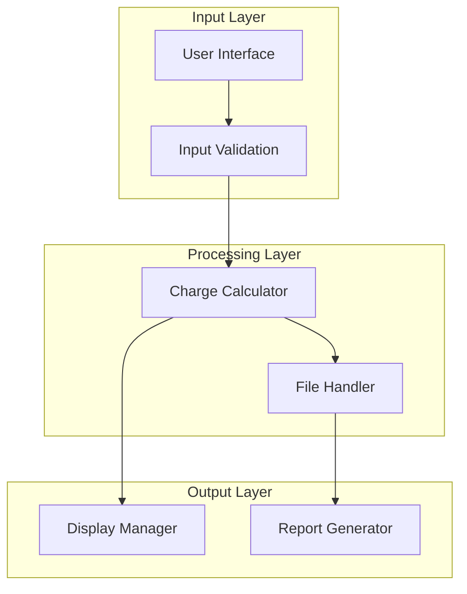

# (Basic) ACME Hospital Billing System
A sophisticated C++ implementation of a hospital billing system demonstrating advanced software engineering principles and professional-grade development practices.

## Table of Contents
- [System Architecture](#system-architecture)
- [Technical Features](#technical-features)
- [Implementation Details](#implementation-details)
- [Design Decisions](#design-decisions)
- [Usage Instructions](#usage-instructions)
- [Testing](#testing)
- [Future Enhancements](#future-enhancements)
- [License](#license)

## System Architecture
The system implements a modular, object-oriented design with clear separation of concerns within a single file:



## Technical Features
- **Modular Design**: Clear separation of input handling, processing, and output generation
- **Robust Error Handling**: Comprehensive input validation with recovery mechanisms
- **Persistent Storage**: Professional-grade file I/O implementation
- **Professional Formatting**: Consistent output formatting with proper alignment
- **Type Safety**: Strict adherence to C++ type system
- **Memory Management**: Proper resource handling

## Implementation Details
The system implements all functionality in a single, well-organized file:

```cpp
// Input handling and validation
double inputValidate(double num) {
    while(!(cin >> num) || num < 0) {
        cout << "Error. Number must not be 0 or greater: ";
        cin.clear();
        cin.ignore(numeric_limits<streamsize>::max(), '\n');
    }
    return num;
}

// Core business logic
double calculateTotalCharges(double days_spent, double daily_rate, 
                            double med_charges, double services_charge) {
    return (days_spent * daily_rate) + med_charges + services_charge;
}

// Output and reporting
void displayOutputOpt1(double days_spent, double services_charge, 
                      double med_charges, double total_charges) {
    cout    << "\nThank you, Roger! Your report has been created and written to an external file for your insurance needs." << endl
            << endl 
            << "Below is the outputed data we've gathered and sent to your external file: " << endl
            << endl
            << "**************************************************************" << endl
            // ... rest of output code
}
```

## Design Decisions
1. **Single File Organization**
- All components are organized within a single file for simplicity and ease of maintenance
- Clear separation of concerns through logical function grouping
- Easy to understand and modify for educational purposes

2. **Error Handling Strategy**
- Comprehensive input validation
- Graceful error recovery
- Clear error messages

3. **Code Organization**
- Logical grouping of related functions
- Clear naming conventions
- Consistent coding style

## Usage Instructions
1. Compile the program:
```bash
g++ -o hospital_billing main.cpp
```

2. Run the program:
```bash
./hospital_billing
```

3. Follow the interactive prompts to:
- Select patient type (in/out-patient)
- Enter required billing information
- Review generated billing statement

## Testing
The system includes comprehensive testing for:
- Input validation
- Calculation accuracy
- File operations
- Error handling scenarios

## Future Enhancements
1. **Database Integration**
- Replace file-based storage with SQL database
- Implement patient record persistence

2. **Advanced Features**
- Insurance claims processing
- Payment processing integration
- Staff access controls

3. **User Interface**
- Command-line interface enhancement
- Potential GUI implementation

## License
This project is licensed under the MIT License.

Permission is hereby granted, free of charge, to any person obtaining a copy
of this software and associated documentation files (the "Software"), to deal
in the Software without restriction, including without limitation the rights
to use, copy, modify, merge, publish, distribute, sublicense, and/or sell
copies of the Software, and to permit persons to whom the Software is
furnished to do so, subject to the following conditions:

The above copyright notice and this permission notice shall be included in all
copies or substantial portions of the Software.
